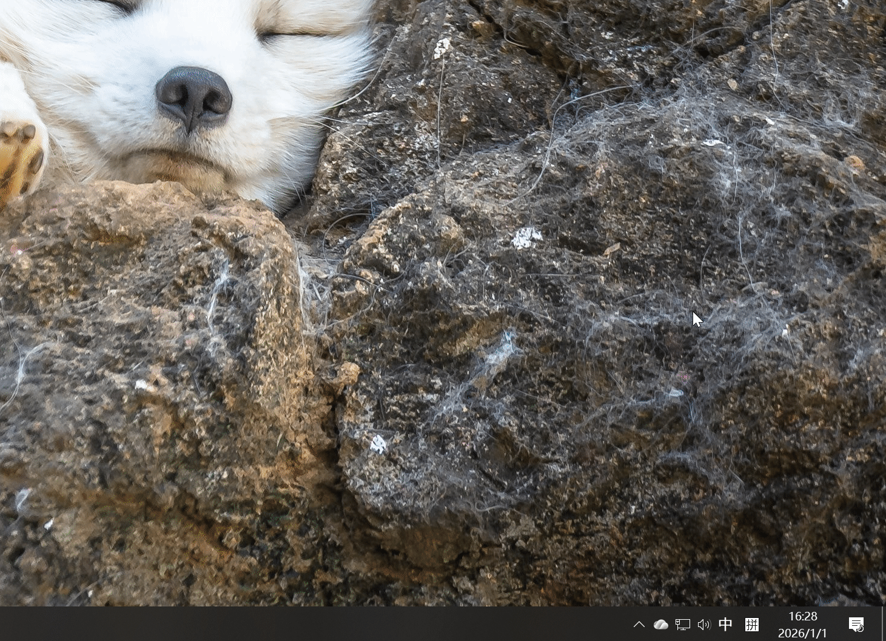

# Audio Sink Nexus

[English](./README.en.md) | [简体中文](./README.md) | [繁體中文](./README.zh_TW.md)

---

Audio Sink Nexus is an audio sink utility built on the Windows 10 AudioPlaybackConnection API. It lets you stream audio wirelessly from devices that support Bluetooth A2DP Source, such as phones and tablets, to a Windows PC for playback.

> This project extends and improves upon [ysc3839/AudioPlaybackConnector](https://github.com/ysc3839/AudioPlaybackConnector).

## Usage

1. **Download and install**
    Download either the installer or the portable package from the [Releases](https://github.com/littrick/litSinkNexus/releases) page, then install or extract it as needed.

2. **Launch the app**
    After startup, you can view the connection status of paired Bluetooth devices in the lower-right corner of the screen, and the app icon will appear in the taskbar area.

3. **Pair a device**
    Right-click the taskbar icon to open the Bluetooth device list, or pair your target Bluetooth A2DP Source device directly in Windows Bluetooth settings.
    

4. **Connect a device**
    Left-click the taskbar icon to open the list of paired devices, then select the device you want to connect.
    

5. **Play audio**
    Once connected, start playback on the paired device and the audio will be streamed wirelessly to your PC.

6. **Disconnect**
    To disconnect, left-click the taskbar icon, select the connected device, and choose to disconnect it.