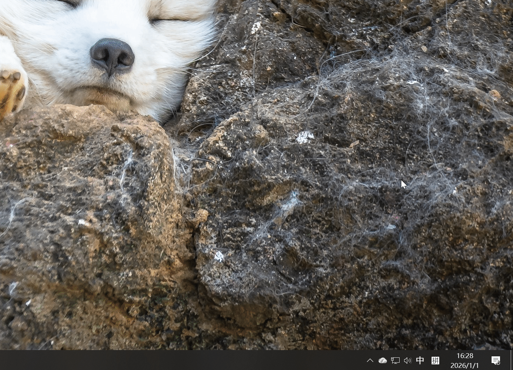

# Audio Sink Nexus

[English](./README_EN.md) | [简体中文](./README.zh_CN.md) | [繁體中文](./README.zh_TW.md)

---

Audio Sink Nexus 是一个基于Windows 10的AudioPlaybackConnection API的音频接收端软件。它允许用户将音频流从支持多个蓝牙A2DP Source的设备（如智能手机、平板电脑等）无线传输到Windows计算机上同时进行播放，界面简洁，操作简单。

> 此项目参考 ysc3839/AudioPlaybackConnector 项目实现，但使用的是Rust语言重新编写，并添加了一些额外的功能和改进

## 使用说明

1. **下载与安装**
    从[发布页面](https://github.com/littrick/litSinkNexus/releases)选择下载安装包或者免安装版本，根据需要进行安装或解压

2. **启动软件**
    安装后双击软件打开，主屏幕右下角会显示已配对的蓝牙设备连接状态，菜单栏会显示本应用的图标

3. **配对设备**
    右键点击任务栏图标，点击打开蓝牙列表，或者在Windows的蓝牙设置中，将需要连接的蓝牙A2DP Source（如智能手机、平板电脑等）设备与计算机进行配对
    

4. **连接设备**
    左键点击任务栏图标，会弹出已配对设备列表，左键点击需要连接的设备即可建立连接
    

5. **播放音频**
    连接成功后，打开蓝牙A2DP Source设备（如智能手机、平板电脑等）上的音频播放应用，开始播放音频，音频将通过无线传输到计算机并进行播放

6. **断开连接**
    需要断开连接时，左键点击任务栏图标，选择已连接的设备，点击断开连接即可